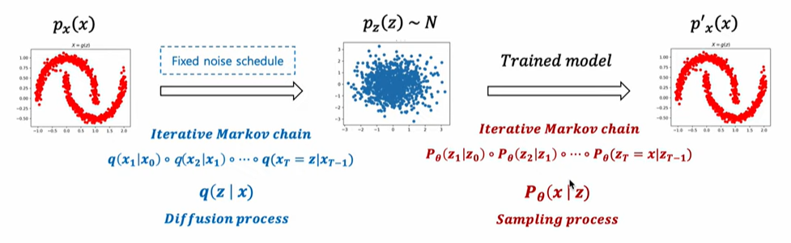

# Denoising Diffusion Probabilistic Models (DDPM)

- 이 논문은 diffusion model을 발전 시킨 논문이다.
  diffusion model
  Markov Chain : 마르코프 체인은 현재사태가 다음 상태를 결정하는 데 필요한 유일한 정보인 시스템을 의미한다.
  Generative Model : 생성 모델은 데이터를 생성할 수 있는 확률 분포를 학습하는 모델이다.
  Generative Markov Chain : 데이터를 생성하는 데 마르코프 체인의 구조를 활용한다.

> 일단 정리

> diffusion model은 데이터에 노이즈를 입히고 나서 노이즈를 제거하는 과정 즉 노이즈를 원래 데이터로 복원하는 과정을 network가 학습하는 것이다. 이 과정에서 Markov Chain이 사용된다.

> 수식에는 $p_\theta(x)$는 $\theta$가 의미하는 network파트로 복원하는 부분을 의미하고 노이즈를 입히는 건$q(x)로 표현한다.

diffusion이란? 우리말로 확산이라 한다. 이 확산이란 단어는 물리적 현상을 지칭하는 것에서 따왔다.
물질들이 특저한 분포가 서서히 와해되는 과정을 말한다.

> Deep Unsupervised Learning using Nonequilibrium Thermodynamics(2015, ICML)에서 비지도학습을 위한 방법론으로 첫 활용

가우시안 노이즈를 통해서 형태가 와해되는 걸 보여준다.
0~T까지 이산적인 단계를 지칭한다.

### Markov Chain

Markov Chain : Markov 성질을 갖는 이산 확률과정

Markov 성질 : "특정 상태의 확률(t+1)은 오직 현재(t)의 상태에 의존한다"

이산 확률 과정 : 이산적인 시간(0초, 1초, 2초, ...) 속에서의 확률적 현상

### VAE

- 인코더와 디코더랄 동시에 학습하는 모델

### VAE likelihood

likelihood의 의미 : likelihood는 모델이 특정 데이터를 생성할 확률이다.

- 데이터를 x라 하고, 모델이 학습하려는 잠재 변수(latent variable)를 z라고 할때, x의 likelihood는 다음과 같이 정의 된다.

### $p(x) = \int{p(x|z)p(z)dz}$

$p(x|z)$: 잠재 변수 z에서 데이터 x가 생성될 조건부 확률(Decorder가 담당)

$p(z)$: 잠재 변수 z의 prior 분포 (일반적으로 z~ N(0,I))

### Flow-based Model

- flow(foward)를 통해서 학습
- 생성할때는 flow(inverse)를 사용함

### Diffusion based generative model

- Diffusion process: $q(z|x)$
- Sampling process: $P_\theta(x|z)$
- 생성에 활용되는 조건부 확률 분포 $P_\theta(x|z)$을 학습하기 위해 Diffusion process $q(z|x)$를 활용

> Sampling process가 학습 대상이다.

- 최종 목표로 $p_\theta(X_{t-1} | X_t) \approx q(X_{t-1} | X_t)$
- 이 과정을 스탭을 잘게 쪼개서 만드는 것이다.( ex. T = 1,000)

### 스터디 내용 정리

> KL Divergence가 중요하다, 수식 전개 한 번 해보기

질문거리

- flow-based 모델의 가역적인 변환을 이용하는 데 이 부분은 diffusion에서도 동일하게 이용하는 거 같아 보이는데 혹시 flow-based model과 diffusion의 차이가 뭘까요?

## Diffusion Probabilistic Models (김인중 교수님)

### Generative Models

- Learn $P(x)$ or $P(x|y)$ 샘플 자체의 확률 분포 자체를 학습 (여기서 y는 class나 label을 의미한다)
  - $P(x)$를 학습할 때는 Unsupervised Learning을 한다는 장점이 있다.

### Deep Generative Models

- Likelihood models
  - Autoregressive models(AR) -> likelihood의 근사값을 사용하는 모델이다.
  - Variational Auto-encoders(VAE)
  - Normalizing flow
  - Diffusion probabilistic models(DPM)
- Non-likelihood model
  - Generative Adversarial Network(GAN)

### 각 Generative 모델들의 장단점

- Autoregressive models
  - 굉장히 강력하고 자연어 분야에서 큰 성과를 거두었다.
  - 단점 1. 느리다 -> sequencial processing을 필요로함
  - 단점 2. latent space를 학습하기 어렵다. -> 추상적인 관계를 학습하기 어렵다.
- Variational inference (VAE)
  - feature learning을 할때 장점이 있다.
  - 단점 1. exact likelihood를 학습하지 않는다.
  - 단점 2. 모델링 파워가 낮다?
- Normalizing flow
  - 단점 1. invertable function을 사용해야한다는 제약 조건이 있다.
  - 단점 2. 제한된 모델 구조를 가지게 된다.
  - 단점 3. 같은 일을 한다고 가정했을 때 더 큰 모델을 사용해야한다.(Parameter-inefficiency)
- Generative adversarial networks(GAN)
  - 단점 1. 학습의 불안정성이 완전하게 해결되지 않았다.(하이퍼 파라미터를 조심스럽게 튜닝해야한다.)
  - 단점 2. 결과물의 다양성이 좋지않다.

## Diffusion Probabilistic Models

- Probabilistic model
- Fast, Parameter efficient
- Flexible

### Foward Trajectory

- Log likelihood maximization
- 수작적인 트릭을 사용 -> log를 중앙으로 넣는다 -> 로그가 안으로 들어가면 밖에 있을때보다 작아진다.
- $\epsilon_\theta$ : 노이즈 벡터
- noise predictor : $\epsilon_\theta(x_t, t)$

- 샘플링 방법 : Langevin dynamics

- score network and noise predictor

- setting $T$ = 1000, $\beta_1$ = $10^-4$, $\beta_T$ = 0.02

## Denoising Diffusion Implicit Models (DDIM)

- 문제점 : 좋은 결과를 얻기 위해서는 1000~4000 step 정도가 필요하므로 시간이 너무 많이 걸리게 된다.
- Non-Markovian diffusion process
- 10x ~ 50x faster than DDPM

- 마르코프 체인을 사용하지 않고 더 과거의 값을 같이 사용하여 다음 값을 정한다.

### Formulation

### Classifier Guidance

- conditional 부분에 해당
- class를 지정하여 해당 하는 class의 분포 쪽으로 sampling 되도록한다.
