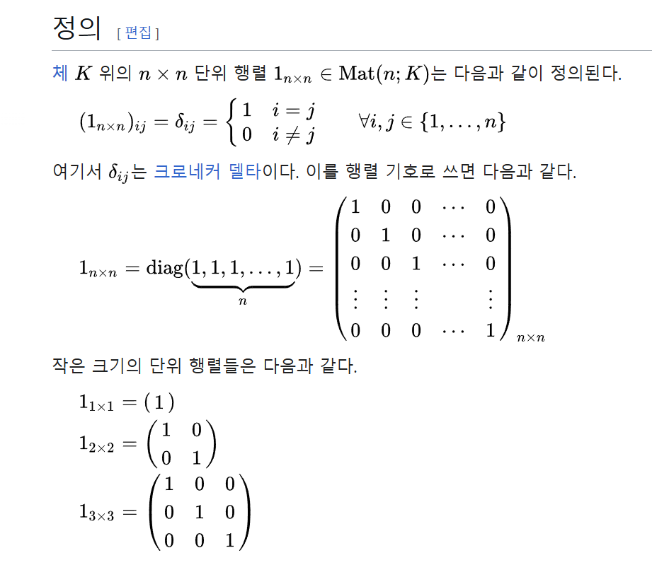

# Denoising Diffusion Probabilistic Models (DDPM)

- 이 논문은 diffusion model을 발전 시킨 논문이다.
  diffusion model
  Markov Chain : 마르코프 체인은 현재사태가 다음 상태를 결정하는 데 필요한 유일한 정보인 시스템을 의미한다.
  Generative Model : 생성 모델은 데이터를 생성할 수 있는 확률 분포를 학습하는 모델이다.
  Generative Markov Chain : 데이터를 생성하는 데 마르코프 체인의 구조를 활용한다.

> 일단 정리

> diffusion model은 데이터에 노이즈를 입히고 나서 노이즈를 제거하는 과정 즉 노이즈를 원래 데이터로 복원하는 과정을 network가 학습하는 것이다. 이 과정에서 Markov Chain이 사용된다.

> 수식에는 $p_\theta(x)$는 $\theta$가 의미하는 network파트로 복원하는 부분을 의미하고 노이즈를 입히는 건$q(x)로 표현한다.

diffusion이란? 우리말로 확산이라 한다. 이 확산이란 단어는 물리적 현상을 지칭하는 것에서 따왔다.
물질들이 특저한 분포가 서서히 와해되는 과정을 말한다.

> Deep Unsupervised Learning using Nonequilibrium Thermodynamics(2015, ICML)에서 비지도학습을 위한 방법론으로 첫 활용

가우시안 노이즈를 통해서 형태가 와해되는 걸 보여준다.
0~T까지 이산적인 단계를 지칭한다.

### Markov Chain

Markov Chain : Markov 성질을 갖는 이산 확률과정

Markov 성질 : "특정 상태의 확률(t+1)은 오직 현재(t)의 상태에 의존한다"

이산 확률 과정 : 이산적인 시간(0초, 1초, 2초, ...) 속에서의 확률적 현상

### VAE

- 인코더와 디코더랄 동시에 학습하는 모델

### VAE likelihood

likelihood의 의미 : likelihood는 모델이 특정 데이터를 생성할 확률이다.

- 데이터를 x라 하고, 모델이 학습하려는 잠재 변수(latent variable)를 z라고 할때, x의 likelihood는 다음과 같이 정의 된다.

### $p(x) = \int{p(x|z)p(z)dz}$

$p(x|z)$: 잠재 변수 z에서 데이터 x가 생성될 조건부 확률(Decorder가 담당)

$p(z)$: 잠재 변수 z의 prior 분포 (일반적으로 z~ N(0,I))

### Flow-based Model

- flow(foward)를 통해서 학습
- 생성할때는 flow(inverse)를 사용함

### Diffusion based generative model

- Diffusion process: $q(z|x)$
- Sampling process: $P_\theta(x|z)$
- 생성에 활용되는 조건부 확률 분포 $P_\theta(x|z)$을 학습하기 위해 Diffusion process $q(z|x)$를 활용

> Sampling process가 학습 대상이다.

- 최종 목표로 $p_\theta(X_{t-1} | X_t) \approx q(X_{t-1} | X_t)$
- 이 과정을 스탭을 잘게 쪼개서 만드는 것이다.( ex. T = 1,000)

### 스터디 내용 정리

> KL Divergence가 중요하다, 수식 전개 한 번 해보기

질문거리

- flow-based 모델의 가역적인 변환을 이용하는 데 이 부분은 diffusion에서도 동일하게 이용하는 거 같아 보이는데 혹시 flow-based model과 diffusion의 차이가 뭘까요?

## Diffusion Probabilistic Models (김인중 교수님)

### Generative Models

- Learn $P(x)$ or $P(x|y)$ 샘플 자체의 확률 분포 자체를 학습 (여기서 y는 class나 label을 의미한다)
  - $P(x)$를 학습할 때는 Unsupervised Learning을 한다는 장점이 있다.

### Deep Generative Models

- Likelihood models
  - Autoregressive models(AR) -> likelihood의 근사값을 사용하는 모델이다.
  - Variational Auto-encoders(VAE)
  - Normalizing flow
  - Diffusion probabilistic models(DPM)
- Non-likelihood model
  - Generative Adversarial Network(GAN)

### 각 Generative 모델들의 장단점

- Autoregressive models
  - 굉장히 강력하고 자연어 분야에서 큰 성과를 거두었다.
  - 단점 1. 느리다 -> sequencial processing을 필요로함
  - 단점 2. latent space를 학습하기 어렵다. -> 추상적인 관계를 학습하기 어렵다.
- Variational inference (VAE)
  - feature learning을 할때 장점이 있다.
  - 단점 1. exact likelihood를 학습하지 않는다.
  - 단점 2. 모델링 파워가 낮다?
- Normalizing flow
  - 단점 1. invertable function을 사용해야한다는 제약 조건이 있다.
  - 단점 2. 제한된 모델 구조를 가지게 된다.
  - 단점 3. 같은 일을 한다고 가정했을 때 더 큰 모델을 사용해야한다.(Parameter-inefficiency)
- Generative adversarial networks(GAN)
  - 단점 1. 학습의 불안정성이 완전하게 해결되지 않았다.(하이퍼 파라미터를 조심스럽게 튜닝해야한다.)
  - 단점 2. 결과물의 다양성이 좋지않다.

## Diffusion Probabilistic Models

- Probabilistic model
- Fast, Parameter efficient
- Flexible

### Foward Trajectory

- 이미지를 노이즈를 씌워서 망가트리는 과정이다.
- $q(x_0)$에서 $x_0$는 diffusion되지 않은 깨끗한 데이터를 의미한다.
- Markov diffusion kernel (바로 전 값만 사용하겠다)

  - **용어 설명**
  - diffusion kernel이라는 용어는 데이터 간의 전이 관계(transition)를 나타내는 함수나 행렬을 의미한다. 그러므로 여기선 $x_t$와 $x_{t-1}$간의 관계를 나타내는 함수를 diffusion kernel이라고 한다.

- $\pi(y) = \int{dy' T_\pi(y|y';\beta)\pi(y')}$ (1)

  - **수식 설명**
  - $\pi(y)$: $y$상태에서의 확률 분포. 여기서 $\pi(y)$는 Markov Chain Monte Calro(MCMC)나 확률적 과정에서 사용되는 목표 분포(taget distribution)로 이해된다. 그렇다면 $\pi(y)$는 정해진 분포이고 주로 diffusion에서는 가우시안 노이즈를 사용한다. 즉 최종적으로 계산하고자 하는 확률 분포를 나타냄
  - 확률 분포: 확률 변수가 특정한 값을 가질 확률을 나타내는 함수. $\pi(y)$와 $\pi(y')$가 각각 $y$와 $y'$ 상태의 확률 분포를 나타냄
  - $\int{dy'}$: 이전의 $y'$값을 모든 가능한 경우에 대해 누적적으로 살펴본다는 의미. 수학적으로는 $T_\pi(y|y';\beta)\pi(y')$를 $y'$에 대해서 적분함으로써 $y$상태의 전체확률을 계산함.
  - $T_\pi(y|y';\beta)$: $y'$에서 $y$로 넘어갈 전이 확률(transition probability).
  - $\pi(y')$: $y'$상태에서의 확률 분포
  - $y$: $y$는 이미지 전체를 의미한다. 그러므로 $\pi(y)$는 이미지가 28x28일 경우 784개의 샘플을 종합한 분포가 되고 이 분포가 목표 분포와 같게 되는 것이 $\pi(y)$이다.

- $q(x_t|x_{t-1}) = T_\pi(x_t|x_{t-1};\beta_t)$ (2)

  - $q(x_t|x_{t-1})$ : Gaussian (or binomial) diffusion ($\beta$ : diffusion rate)
  - Gaussian은 경우는 continuous한 정보를 표현, binomial은 discrete한 정보를 표현하는 모델(대부분 Gaussian을 사용)
  - **$\beta$**는 diffusion rate을 의미하고 이는 이미지가 한번에 얼마나 망가지는 지를 말한다. 즉, $\beta$값이 거치게 되면 한번에 이미지가 많이 망가지게 되고 작을 경우는 반대로 적게 망가지게 된다.
  - $q(x_t|x_{t-1}) = N(x_t;\sqrt{1-\beta}x_{t-1}, \beta_tI)$
    - 어떤 확률 분포, 즉 정규 분포에 평균과 분산을 지정해서 특정 확률 분포를 만들어 x_t가 해당하는 확률분포에 맞는 값이 되도록 한다.
    - $q(x_t|x_{t-1})$는 확률 분포 그 자체를 나타내며, $x_t$가 어떤 값을 가질 확률을 의미한다.
    - 평균 : $\sqrt{1-\beta}x_{t-1}$, 공분산 : $\beta_tI$
      - 여기서 공분산을 사용하는 이유는 데이터가 matrix이기에 **multivariate gaussian distribution**을 사용하므로 분산의 형태가 행렬이 되기 때문이다.
      - 그런데 보통 공분산의 행렬 표기는 $\Sigma$이지만 이는 각 변수의 분산이 모두 다른 것을 의미한다. 그러나 diffusion에서는 분산을 모두 1로 사용하기에 $I$를 사용한다.
      - $I$는 단위행렬(unit martrix) 또는 항등 행렬(identity matrix)라고 한다. 이는 주대각선의 원소가 모두 1이며 나머지 원소는 모두 0인 정사각 행렬이다.
        </img>
  - $q(x_{0...T}) = q(x_0)\displaystyle \prod_{t=1}^T q(x_t|x_{t-1})$ (3)

### Reverse Trajectory

- Restore data from noise

  - $p(x_T) = \pi(x_T)$ (4)
  - $p(x_{0...T}) = p(x_T)\displaystyle \prod_{t=1}^T p(x_{t-1}|x_t)$ (5)

- Log likelihood maximization
- 수학적인 트릭을 사용 -> log를 중앙으로 넣는다 -> 로그가 안으로 들어가면 밖에 있을때보다 작아진다.
- $\epsilon_\theta$ : 노이즈 벡터
- noise predictor : $\epsilon_\theta(x_t, t)$

- 샘플링 방법 : Langevin dynamics

- score network and noise predictor

- setting $T$ = 1000, $\beta_1$ = $10^-4$, $\beta_T$ = 0.02

## Denoising Diffusion Implicit Models (DDIM)

- 문제점 : 좋은 결과를 얻기 위해서는 1000~4000 step 정도가 필요하므로 시간이 너무 많이 걸리게 된다.
- Non-Markovian diffusion process
- 10x ~ 50x faster than DDPM

- 마르코프 체인을 사용하지 않고 더 과거의 값을 같이 사용하여 다음 값을 정한다.

### Formulation

### Classifier Guidance

- conditional 부분에 해당
- class를 지정하여 해당 하는 class의 분포 쪽으로 sampling 되도록한다.
