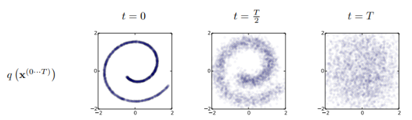
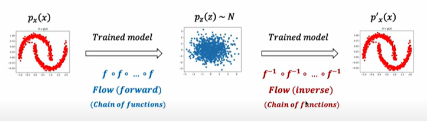

# Denoising Diffusion Probabilistic Models (DDPM)

- 이 논문은 diffusion model을 발전 시킨 논문이다.
  diffusion model
  Markov Chain : 마르코프 체인은 현재사태가 다음 상태를 결정하는 데 필요한 유일한 정보인 시스템을 의미한다.
  Generative Model : 생성 모델은 데이터를 생성할 수 있는 확률 분포를 학습하는 모델이다.
  Generative Markov Chain : 데이터를 생성하는 데 마르코프 체인의 구조를 활용한다.

> 일단 정리

> diffusion model은 데이터에 노이즈를 입히고 나서 노이즈를 제거하는 과정 즉 노이즈를 원래 데이터로 복원하는 과정을 network가 학습하는 것이다. 이 과정에서 Markov Chain이 사용된다.

> 수식에는 $p_\theta(x)$는 $\theta$가 의미하는 network파트로 복원하는 부분을 의미하고 노이즈를 입히는 건$q(x)로 표현한다.

diffusion이란? 우리말로 확산이라 한다. 이 확산이란 단어는 물리적 현상을 지칭하는 것에서 따왔다.
물질들이 특저한 분포가 서서히 와해되는 과정을 말한다.

> Deep Unsupervised Learning using Nonequilibrium Thermodynamics(2015, ICML)에서 비지도학습을 위한 방법론으로 첫 활용

가우시안 노이즈를 통해서 형태가 와해되는 걸 보여준다.
0~T까지 이산적인 단계를 지칭한다.

### Markov Chain

Markov Chain : Markov 성질을 갖는 이산 확률과정

Markov 성질 : "특정 상태의 확률(t+1)은 오직 현재(t)의 상태에 의존한다"

이산 확률 과정 : 이산적인 시간(0초, 1초, 2초, ...) 속에서의 확률적 현상

### VAE

- 인코더와 디코더랄 동시에 학습하는 모델

### VAE likelihood

likelihood의 의미 : likelihood는 모델이 특정 데이터를 생성할 확률이다.

- 데이터를 x라 하고, 모델이 학습하려는 잠재 변수(latent variable)를 z라고 할때, x의 likelihood는 다음과 같이 정의 된다.

### $p(x) = \int{p(x|z)p(z)dz}$

$p(x|z)$: 잠재 변수 z에서 데이터 x가 생성될 조건부 확률(Decorder가 담당)

$p(z)$: 잠재 변수 z의 prior 분포 (일반적으로 z~ N(0,I))

### Flow-based Model

- flow(foward)를 통해서 학습
- 생성할때는 flow(inverse)를 사용함

### Diffusion based generative model

- Diffusion process: $q(z|x)$
- Sampling process: $P_\theta(x|z)$
- 생성에 활용되는 조건부 확률 분포 $P_\theta(x|z)$을 학습하기 위해 Diffusion process $q(z|x)$를 활용
