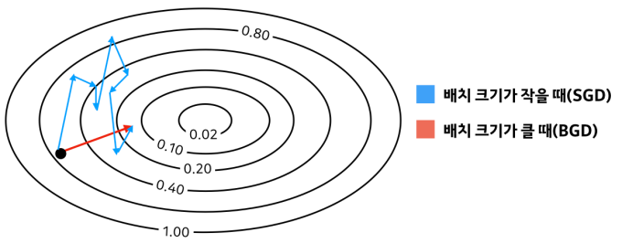

# Learn the Basics

### machine learing work flow

1. [working with data (데이터 작업)](#working-with-data)
2. creating models (모델 생성)
3. optimizing model parameters (모델 매개변수 최적화)
4. saving the trained models (학습된 모델 저장)

## Working with data

pytorch에는 데이터를 처리하는 두 가지 기본형이 있다.

- torch.utils.data.DataLoader
- torch.utils.data.DataSet.

```python
import torch
from torch import nn
from torch.utils.data import DataLoader
from torchvision import datasets
from torchvision.transforms import ToTensor
```

```python
DataLoader(dataset, batch_size=16, shuffle=False, )
```

DataLoader의 파라미터 dataset, batch_size, shuffle

### **batch_size**

- batch란 학습을 할 때 모델에 한번에 들어가게 되는 데이터 집합을 의미한다.
- 이 때 이 batch에 포함된 데이터의 개수를 batch size라고 한다.

  

  > epoch은 train 데이터 전체를 한 번 보는 기준으로 생각하면 된다.

**batch_size와 학습 시간**
<br>

> 학습을 할때 일반적으로 GPU를 사용하므로 batch_size와 상관없이 하나의 batch를 학습하는 시간은 동일하다. 그러므로 1000개의 데이터를 batch_size를 1로 학습했을 때 1000번 학습을 하지만
> 1000개의 데이터를 batch_size를 1000으로 학습하게 되면 1번 학습을 진행한다.

**batch_size와 학습**

> batch_size가 클때: 많은 양의 데이터를 한번에 볼 수 있다는 것이다. 이 경우 학습을 하고 모델의 가중치를 갱신할 때 최적화된 경로로 가중치를 갱신하게 된다

> batch_size가 작을때: 학습을 진행할 때 batch에 특이값(Outlier)가 포함되었을 때 실제 최적화된 경로가 아닌 다른 경로로 모델의 가중치가 갱신된다.



이렇게 보면 batch_size가 큰게 좋아 보이지만 실제로 local optimal에 빠지게 되면 거기서 빠져 나올 방법이 없지만 batch_size가 작은 경우는 local optimal에 빠지게 되더라도 batch 내부의 트이값 혹은 그 자체의 분포가 실제 train 데이터의 분포와 다르기 때문에 train 데이터의 최적화 된 경로가 아닌 다른 경로로 움직여 local optimal에서 빠져나올 수 있게된다.

> local optimal은 local minimun, local maximum을 포함하는 용어

<hr/>

### DataSet 준비

- torchvision.datasets모듈의 FashionMNIST 데이터 사용
  > [custom dataset 만들기](pytorch_tutorial\CustomDataSet)

```python
# Download training data from open datasets.
training_data = datasets.FashionMNIST(
    root="data",
    train=True,
    download=True,
    transform=ToTensor(),
)

# Download test data from open datasets.
test_data = datasets.FashionMNIST(
    root="data",
    train=False,
    download=True,
    transform=ToTensor(),
)
```

### DataLoader 생성

```python
batch_size = 64

# Create data loaders.
train_dataloader = DataLoader(training_data, batch_size=batch_size)
test_dataloader = DataLoader(test_data, batch_size=batch_size)

for X, y in test_dataloader:
    print(f"Shape of X [N, C, H, W]: {X.shape}")
    print(f"Shape of y: {y.shape} {y.dtype}")
    break
```
